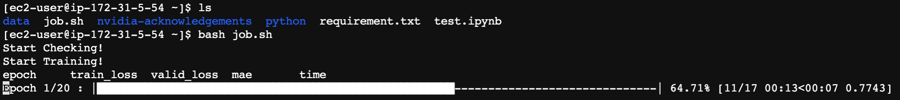
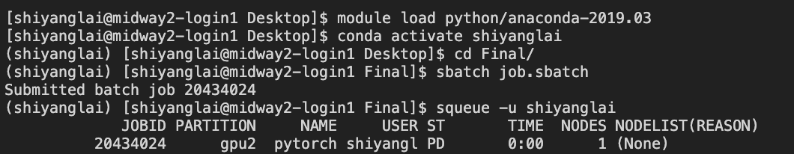
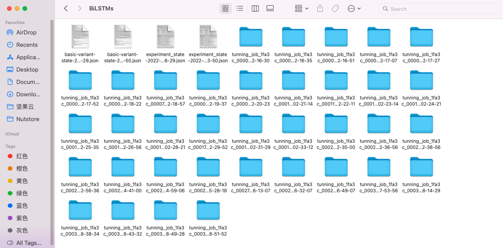

# __The Evolution of Spillovers Between Cryptocurrencies and Conventional Currencies: The Complexity and Dynamism of Cross-Market Interaction__

This is the GitHub repository for the final project of MACS 30123 Large Scale Computing.

__Author:__ Shiyang Lai, Peihan Gao, Juno Wu, Coco Yu

The codes were written in Python 3.9.7 and R, and all of its dependencies can be installed by running the following in the terminal (with the `requirements.txt` file included in this repository):
```
$ pip install -r requirements.txt
```

## Project Description
The current project aims at exploring the spillovers between cryptocurrencies and conventional currencies. We pooled historical historical data from 155 mainstream conventional currencies and cryptocurrencies from Sep 1 2015 to May 1 2022, and employed a compute-intensive framework incorporating both econometric measures and up-to-date neural architectures for data analysis. Raw data are available both in the `Raw data` folder in this github repository (https://github.com/lsc4ss-s22/final-project-crypto/tree/main/Raw%20data) and in a S3 bucket (https://crypto-conven-training.s3.us-west-2.amazonaws.com). To speed up calculations, we utilized large-scale parallel processing including MPI, PySpark, and GPU computing.


## Data Processing and Analysis
### 1. Spark-based Data Preprocessing Pipeline
> Read currency data and calculate returns and volatility of currencies.

**Codes available at:** <a href="https://github.com/lsc4ss-s22/final-project-crypto/blob/main/Python%20scripts/data%20preprocessing.py">data preprocessing.py</a>

<!-- **Speedup (PySpark 2.4)??????:** <a href="https://github.com/lsc4ss-s22/final-project-crypto/blob/main/Notebooks/pyspark_graphframe.ipynb"> pyspark_graphframe.ipynb</a> -->

### 2. Paralleled Economic Spillovers Computation with R
> Do VAR lag fitting, calculate spillovers, and output network graph.

**Codes availabe at:** <a href="https://github.com/lsc4ss-s22/final-project-crypto/blob/main/R%20Scripts/parallel.R"> parallel.R</a>

Spillover networks under short-, medium-, and long-frequency bands


**Speedup (Rmpi Package for R):**\
Online documentation: https://cran.r-project.org/web/packages/Rmpi/index.html \
Rmpi installation for Mac OS X: http://fisher.stats.uwo.ca/faculty/yu/Rmpi/mac_os_x.htm \
Rmpi installation for Windows: http://fisher.stats.uwo.ca/faculty/yu/Rmpi/windows.htm \
Rmpi installation for Linux: http://fisher.stats.uwo.ca/faculty/yu/Rmpi/install.htm

### 3. Data Storage with S3 and Dynamo DB
> Output files in the previous two steps were uploaded to S3 bucket `crypto-conven-training (us-west-2)` and Dynamo DB `table=return_prediction`

**Codes available at:** <a href="https://github.com/lsc4ss-s22/final-project-crypto/blob/main/Notebooks/to_dynamodb.ipynb"> to_dynamodb.ipynb</a>

Snapshot of S3 Bucket

Snapshot of DynamoDB


### 4. Deep Learning Model Training using AWS EC2 Instances and Midway GPU Nodes
> Use deep learning models to predict prices of cryptocurrencies and conventional currencies

**Helper packages available at:**
- <a href="https://github.com/lsc4ss-s22/final-project-crypto/blob/main/Python%20scripts/utils.py">`utils.py`</a> 
- Model Training: Scikit-learn <a href="https://github.com/lsc4ss-s22/final-project-crypto/blob/main/Python%20scripts/sklearn_training.py">`sklearn_training.py`</a>; PyTorch <a href="https://github.com/lsc4ss-s22/final-project-crypto/blob/main/Python%20scripts/torch_training.py">`torch_training.py`</a> 
- Model Evaluation: <a href="https://github.com/lsc4ss-s22/final-project-crypto/blob/main/Python%20scripts/evaluation.py"> `evaluation.py`</a>

**Run the following codes using AWS EC2 CPU training with <a href="https://github.com/lsc4ss-s22/final-project-crypto/blob/main/job.sh">job.sh</a>:**
``` shell
$ bash job.sh
```
Snapshot of deploying models on an AWS EC2 t2.large instance


**Run the following codes using Midway2 GPU training with <a href="https://github.com/lsc4ss-s22/final-project-crypto/blob/main/job.sbatch">job.sbatch</a>:**
``` shell
$ sbatch job.sbatch
```
Snapshot of deploying models on an GPU node in gpu2 cluster

We ran six models (i.e., BiLSTMs, ResNet, gMLP, TST, MLSTM-FCN, XCM) on six currencies (i.e., EUR, GBP, AUD, BTC, ETH, DOGE). It took about 2-hour to use one GPU on midway2 to finish the training for one currency on the six models.

### 5. Scalabel Hyperparameter Tuning with _Ray_
**Source codes available at:** <a href="https://github.com/lsc4ss-s22/final-project-crypto/blob/main/Python%20scripts/tuning.py">tuning.py</a>

Snapshot of the tuning result of BiLSTMs


### 6. Spillovers Network Analysis with Pyspark Graphframe
**Codes available at:** <a href="https://github.com/lsc4ss-s22/final-project-crypto/blob/main/Notebooks/graphframe_analysis.ipynb">graphframe_analysis.ipynb</a>

### 7. Visualization
> Plot predictability comparison (with cross-market information and without) for the six models

**Codes available at:** <a href="https://github.com/lsc4ss-s22/final-project-crypto/blob/main/Notebooks/visualization.ipynb">visualization.ipynb</a>


## License

## __To-do List__
- [x] Spark-based Data Preprocessing Pipeline
- [x] Paralleled Economic Spillovers Computation with R
- [x] Data Storage with S3 and DynamoDB
- [x] Deep Learning Model Training using AWS EC2 Instances and Midway GPU Nodes 
- [x] Scalable Hyperparameter Tuning with _Ray_
- [x] Spillovers Network Analysis with Pyspark Graphframe
- [x] Visualization
