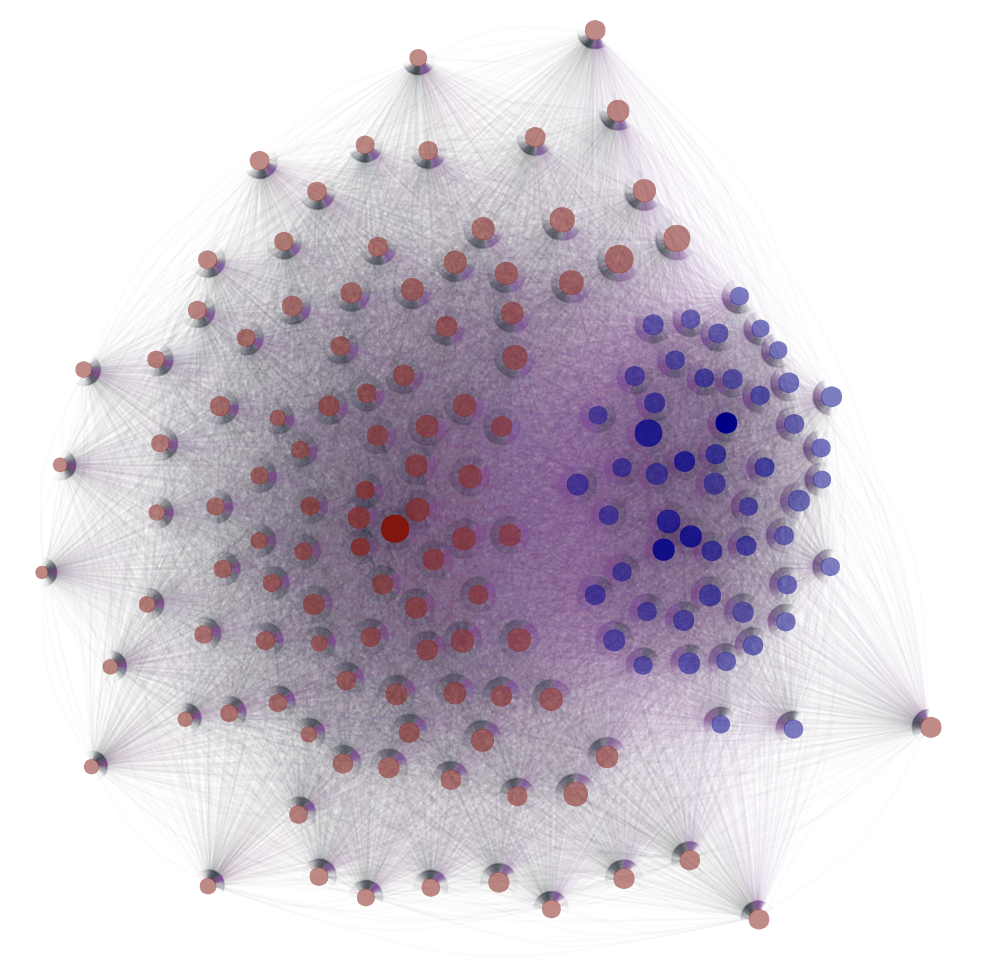

# __The Evolution of Spillovers Between Cryptocurrencies and Conventional Currencies: The Complexity and Dynamism of Cross-Market Interaction__

This is the GitHub repository for the final project of MACS 30123 Large Scale Computing.

__Authors:__ Shiyang Lai, Peihan Gao, Juno Wu, Coco Yu

The codes were written in Python 3.9.7 and R, and all of its dependencies can be installed by running the following in the terminal (with the `requirements.txt` file included in this repository):
```
$ pip install -r requirements.txt
```

## Project Description
### Background
As the cryptocurrency market becomes more developed and popular, more information is needed on how it connects with the traditional currency market. Will the cryptocurrency market's fluctuation has a big effect on traditional currency market that may cause it to fluctuate as well, or will it be the other way around, or both? The current project aims at exploring the spillovers between cryptocurrencies and conventional currencies. We pooled historical data from 155 mainstream conventional currencies and cryptocurrencies from Sep 1 2015 to May 1 2022, and employed a compute-intensive framework incorporating both econometric measures and up-to-date neural architectures for data analysis. Raw data are available both in the `Raw data` folder in this github repository (https://github.com/lsc4ss-s22/final-project-crypto/tree/main/Raw%20data) and in a S3 bucket (https://crypto-conven-training.s3.us-west-2.amazonaws.com). To speed up calculations, we utilized large-scale parallel processing including MPI, PySpark, and GPU computing. We believe that this project will provide more in-depth exploration of the diversity, dynamics, and other complex characteristics of their interaction.Also, it brings significant implications to investors and policymakers about potential risks and opportunities. 

### Workflow Design
This diagram describes the workflow of this project. Various large-scale computing techniques were employed in our work. Firstly, we stored all the raw data in an AWS S3 bucket and constructed a PySpark-based data preprocessing pipeline using EMR to clean and slice the data for rolling window analysis. In the meantime, the raw data was also inputted into a large VAR model to obtain the currency connectedness networks. This process was done on local machines but also accelerated by MPI parallel programming. Moving back to the front channel, we fed the sliced price sequence windows to two deep learning pipelines for hyperparameter tuning, training, and evaluation. The two pipelines were deployed on midway2. 6 GPU nodes participated in the computing process. After that, the evaluation results were sent back to AWS DynamoDB for further analysis. We also uploaded the connectedness networks we obtained in local machines to the AWS EMR cluster and performed network analysis on them with PySpark Graphframe. In summary, this project incorporated various large-scale computing techniques and resources provided on different platforms together.


## Data Processing and Analysis
### 1. Spark-based Data Preprocessing Pipeline
> Data processing contains:        
  0. Upload the folder of raw csv files into S3 bucket        
  1. Read currencies raw data from S3 bucket    
  2. Fill nulls  with interpolate (exchange) and forward/backward filling (symbol)     
  3. Unify the unit (unify the format of currency symbols and corresponding exchanges)      
  4. Calculate the returns, volatility, exchange rate of currencies   
  5. Generate a dictonary of pyspark dataframe            
  --      time elapsed     --               
    - parallel version 2 mins                       
    - serial version 10 mins               
  6. Write each dataframe in the dictionary as parquet into S3 bucket. (15 parquets ~ 60mins)         
     
> The parallelization is conducted with pyspark on EMR notebook.                  
                             

**Original codes available at:** <a href="https://github.com/lsc4ss-s22/final-project-crypto/blob/main/Python%20scripts/data%20preprocessing.py">data preprocessing.py</a>

**Paralleled codes with pyspark available at:**                                    
1. Script: <a href="https://github.com/lsc4ss-s22/final-project-crypto/blob/main/Python%20scripts/preprocessing.py">preprocessing.py</a>                      
2. notebook:  <a href="https://github.com/lsc4ss-s22/final-project-crypto/blob/main/Notebooks/preprocess.ipynb">preprocess.ipynb</a>              

<!-- **Speedup (PySpark 2.4)??????:** <a href="https://github.com/lsc4ss-s22/final-project-crypto/blob/main/Notebooks/pyspark_graphframe.ipynb"> pyspark_graphframe.ipynb</a> -->

### 2. Paralleled Economic Spillovers Computation with R
> Do VAR lag fitting, calculate spillovers, and output network graph.
> After the implementation of Rmpi(parallel processing locally with work distributed to 3 cores, the running time is down to 20 minutes, in comparison to 40 minutes when serial processing. 

**Codes availabe at:** <a href="https://github.com/lsc4ss-s22/final-project-crypto/blob/main/R%20Scripts/parallel.R"> parallel.R</a>

Plots below present the computed return-based currency connectedness networks under short-, medium-, and long-frequency bands. Dark red nodes represent cryptocurrencies and dark blue nodes represent traditional currencies. The color of linkages between currency pairs belonging to the same market is set to gray, otherwise, it is set to purple. The width of edges reflects the connectedness level. The opacity of nodes is determined by their within-market weighted in-degree, and the size of nodes signifies their cross-market weighted in-degree. This visualization serves as an overview of the currency interaction system.




**Speedup (Rmpi Package for R):**\
Online documentation: https://cran.r-project.org/web/packages/Rmpi/index.html \
Rmpi installation for Mac OS X: http://fisher.stats.uwo.ca/faculty/yu/Rmpi/mac_os_x.htm \
Rmpi installation for Windows: http://fisher.stats.uwo.ca/faculty/yu/Rmpi/windows.htm \
Rmpi installation for Linux: http://fisher.stats.uwo.ca/faculty/yu/Rmpi/install.htm

### 3. Data Storage with S3 and Dynamo DB
> Raw currency data files, processing module script and the processed data files are saved in S3 bucket `crpytoconven (us-east-1)      `      
                     
To benefit cross-platform communication, we uploaded all the script module and data into the bucket.             

Image below is the snapshot of the raw data in the S3 Bucket.                             
      
Image below is the snapshot of the parallel module script in the S3 Bucket.              
       
Image below is the snapshot of the processed data in the S3   Bucket.            
                 
                                  
                   
> Output files in the previous two steps were uploaded to S3 bucket `crypto-conven-training (us-west-2)` and Dynamo DB `table=return_prediction`

**Codes available at:** <a href="https://github.com/lsc4ss-s22/final-project-crypto/blob/main/Notebooks/to_dynamodb.ipynb"> to_dynamodb.ipynb</a>

Image below is the snapshot of the project S3 Bucket. To benefit cross-platform communication, we uploaded all the code and data into the bucket.

This image is a snapshot of DynamoDB. All the outputs of the deep learning pipelines on the midway were stored in it.


### 4. Deep Learning Model Training using AWS EC2 Instances and Midway GPU Nodes
> Use deep learning models to predict prices of cryptocurrencies and conventional currencies

**Helper packages available at:**
- <a href="https://github.com/lsc4ss-s22/final-project-crypto/blob/main/Python%20scripts/utils.py">`utils.py`</a> 
- Model Training: Scikit-learn <a href="https://github.com/lsc4ss-s22/final-project-crypto/blob/main/Python%20scripts/sklearn_training.py">`sklearn_training.py`</a>; PyTorch <a href="https://github.com/lsc4ss-s22/final-project-crypto/blob/main/Python%20scripts/torch_training.py">`torch_training.py`</a> 
- Model Evaluation: <a href="https://github.com/lsc4ss-s22/final-project-crypto/blob/main/Python%20scripts/evaluation.py"> `evaluation.py`</a>

**Run the following codes using AWS EC2 CPU training with <a href="https://github.com/lsc4ss-s22/final-project-crypto/blob/main/job.sh">job.sh</a>:**
``` shell
$ bash job.sh
```
This snapshot records the model deploying process on an AWS EC2 t2.large instance. Unfortunately, due to the limitation of the computing power of the t2.large instance, we were not able to finish the training within 4 hours, so the AWS academy automatically interrupted the program.


**Run the following codes using Midway2 GPU training with <a href="https://github.com/lsc4ss-s22/final-project-crypto/blob/main/job.sbatch">job.sbatch</a>:**
``` shell
$ sbatch job.sbatch
```
This snapshot shows the model deploying process on a GPU node in the gpu2 cluster. With 1 GPU, 1 CPU, and 10 GiB for each task, we were able to finish one experiment within 3 hours.

We ran six models (i.e., BiLSTMs, ResNet, gMLP, TST, MLSTM-FCN, XCM) on six currencies (i.e., EUR, GBP, AUD, BTC, ETH, DOGE). The tasks were distributed using the embarrassingly parallel computing strategy. Thus, with six GPU nodes, we finished all the experiments for each currency within 3-hour. As a comparison, it took about 1 day to finish the task in a MacBook Pro with an M1 core.

### 5. Scalabel Hyperparameter Tuning with _Ray_
**Source codes available at:** <a href="https://github.com/lsc4ss-s22/final-project-crypto/blob/main/Python%20scripts/tuning.py">tuning.py</a>

This image shows the automatic log folder created by _ray_ for the tuning results of BiLSTMs. Each subfolder contains the model evaluation result of one possible hyperparameter combination. These tasks were automatically distributed to computing resources on midway2.


### 6. Spillovers Network Analysis with Pyspark Graphframe
**Codes available at:** <a href="https://github.com/lsc4ss-s22/final-project-crypto/blob/main/Notebooks/graphframe_analysis.ipynb">graphframe_analysis.ipynb</a>

### 7. Visualization
> Plot predictability comparison (with cross-market information and without) for the six models

**Codes available at:** <a href="https://github.com/lsc4ss-s22/final-project-crypto/blob/main/Notebooks/visualization.ipynb">visualization.ipynb</a>

This visualization presents the comparison results of the two deep learning pipelines under the six prediction neural architectures. The horizontal axis is time window index, Window, and the vertical axis is the reduction in MAPE after adding additional cross-market information, ∆MAPE. The fitted polynomial regression curves represent the dynamic of the change of ∆MAPE. In the six models, BiLSTMs, ResNet, MLSTM-FCN, and XCM provide consistency outputs. We found that currencies within the same markets present similar ∆MAPE dynamics. Specifically, for all conventional currencies (i.e., AUD, EUR, GBP), their ∆MAPE drops and then increase later. But for cryptocurrencies (i.e., BTC, ETH, DOGE), their ∆MAPE changing direction is just the opposite of the conventional ones. This finding reveals that the spillovers between cryptocurrencies and conventional currencies are asymmetric - the spillovers from crypto coins to conventional currencies are growing in recent years but the spillovers from fiat currencies to cryptocurrencies are actually decreasing. 

The exponential growth of Bitcoin and altcoins and the dramatic fluctuation of their prices are increasingly raising researchers’ concerns in recent years. Whether cryptocurrencies still maintain their safe-haven property? Will the crash of the cryptocurrency market be able to impulse strong impacts on the other financial markets? How to prevent the spillovers from high-risk crypto assets to the other assets? All these questions remain to be studied. To provide part of the answer, this research, combining both a traditional econometric analysis framework and a deep learning-based analysis framework together, investigated the spillovers between cryptocurrencies and conventional currencies in-depth. We found that the additional conventional currencies price prediction power injected by the historical market information of cryptocurrencies is growing these years which implies the growing spillovers from the crypto coin market to the conventional currency market. Although the growing trend only exists in one direction, the dynamic implies that crypto coins might be gradually losing their safe-haven capability today.


### 8. Limitations
The first limitation of this study is that we were unable to find an approach to run our R code on AWS or midway parallelly, which restricts our scalability from the hardware end. If we were able to use more cores than 3, we believe that the process of calculating spillovers and generating graphs will be even faster than 20 minutes. In addition, the time it takes for writing data frames into S3 bucket by Pyspark parquet is a bit long (~60mins). In the future, we might need to find new approaches to speed up this process. Also, our study is limited by the available resources from AWS EC2 instances. This limited availability inevitably leads to the failing of our parallelization on AWS with the 4-hour limit running time. Finally, we were not able to finish a more complete visualization of our findings due to the time limit.

## Contributions
Data gathering and preprocessing – Shiyang Lai & Peihan Gao

VARX-L model-based currency spillovers calculation – Juno Wu & Coco Yu

Prediction models training, running and evaluation – Shiyang Lai & Peihan Gao

README file creation – Juno Wu, Coco Yu, Shiyang Lai, Peihan Gao

Presentation visualization – Juno Wu & Coco Yu

Presentation recording – Shiyang Lai, Peihan Gao, Coco Yu, Juno Wu

## <a href="https://github.com/lsc4ss-s22/final-project-crypto/blob/main/license">**License** </a>
Copyright (c) 2022 lsc4ss-s22-group-project

Permission is hereby granted, free of charge, to any person obtaining a copy
of this software and associated documentation files (the "Software"), to deal
in the Software without restriction, including without limitation the rights
to use, copy, modify, merge, publish, distribute, sublicense, and/or sell
copies of the Software, and to permit persons to whom the Software is
furnished to do so, subject to the following conditions:

The above copyright notice and this permission notice shall be included in all
copies or substantial portions of the Software.

THE SOFTWARE IS PROVIDED "AS IS", WITHOUT WARRANTY OF ANY KIND, EXPRESS OR
IMPLIED, INCLUDING BUT NOT LIMITED TO THE WARRANTIES OF MERCHANTABILITY,
FITNESS FOR A PARTICULAR PURPOSE AND NONINFRINGEMENT. IN NO EVENT SHALL THE
AUTHORS OR COPYRIGHT HOLDERS BE LIABLE FOR ANY CLAIM, DAMAGES OR OTHER
LIABILITY, WHETHER IN AN ACTION OF CONTRACT, TORT OR OTHERWISE, ARISING FROM,
OUT OF OR IN CONNECTION WITH THE SOFTWARE OR THE USE OR OTHER DEALINGS IN THE
SOFTWARE.
